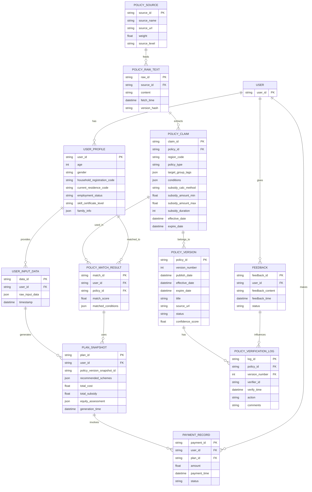

# AI社保智筹 - 产品需求说明书 (PRD) V1.2.1

| 文档属性 | 内容 |
| :--- | :--- |
| **产品名称** | AI社保智筹 |
| **版本号** | V1.2.1 |
| **文档级别** | L4 (Standard) |
| **状态** | 待评审 |
| **编写依据** | BRD V1.1.0 / MRD V1.1.0 / SOP L1-一号文件 |
| **发布日期** | 2026-05-22 |
| **更新说明** | 补充置信度评分配置说明、合规认定动态渲染说明、基线版本功能状态说明、文档级别标注；V1.2.0 归档。 |

---

## 1. 文档概述

### 1.1 文档目的与适用范围
本产品需求说明书（PRD）旨在为"AI社保智筹"产品提供全面、详细的需求定义，作为产品开发、设计、测试和运营的指导性文档。它将明确产品的功能、非功能性需求、业务逻辑、交互细节、技术选型建议及验收标准，确保各团队对产品目标和实现路径达成共识。

### 1.2 读者对象
*   **产品经理**：进行需求管理与迭代规划。
*   **UI/UX设计师**：基于功能与交互逻辑进行界面设计与原型制作。
*   **前端/移动端开发工程师**：实现原生App、小程序界面与前端逻辑。
*   **后端开发工程师**：实现业务逻辑、数据接口与算法服务。
*   **算法工程师**：优化政策匹配与方案生成算法。
*   **测试工程师**：编写测试用例，进行功能与性能测试。
*   **运营团队**：理解产品功能，进行用户运营与政策维护。

### 1.3 与 BRD 的关系
本 PRD 是对 BRD（业务需求说明书）的进一步细化和落地。BRD 阐述了"为什么做"和"做什么"的宏观业务目标与商业价值，而 PRD 则详细定义了"怎么做"的具体功能实现细节、交互流程和技术要求。

### 1.4 参考文档
*   《AI社保智筹-市场需求说明书 (MRD) V1.1.0》
*   《AI社保智筹-业务需求说明书 (BRD) V1.1.0》
*   《SOP L1-一号文件》（内部标准操作流程）

---

## 2. 术语定义

| 术语 | 定义 |
| :--- | :--- |
| **政策原子 (Claim)** | 政策文本中不可再分的最小逻辑单元，例如"女性满40周岁"、"补贴金额500元/月"、"需提供失业证明"等。每个 Claim 具有独立的属性和状态。 |
| **置信度评分 (Confidence Score)** | 基于政策来源等级、多源交叉验证结果、时效性、冲突情况等因素，综合计算出的政策真实性与可靠性分值（0.0-1.0）。 |
| **帕累托最优方案 (Pareto Optimal Plan)** | 在合规性、用户经济承受能力、社保权益最大化等多个约束条件下，通过优化算法得出的、无法在不牺牲任一目标的前提下改进其他目标的社保缴纳方案。 |
| **GB/T 2260** | 中华人民共和国行政区划代码标准，用于精准定位省/市/区/街道等各级行政区域。 |
| **4050人员** | 指女性40周岁以上、男性50周岁以上的法定劳动年龄内就业困难人员，通常可享受特定的社保补贴政策。 |
| **LBS** | Location Based Service，基于位置的服务，通过地理定位技术获取用户当前位置信息。 |
| **RTM** | Requirements Traceability Matrix，需求追踪矩阵，用于追溯需求来源、实现情况和测试覆盖。 |

---

## 3. 产品范围与边界

### 3.1 MVP 范围 (V1.2.x)
*   **核心城市**：首批覆盖全国 GDP 前 5 城市：**上海、北京、深圳、广州、杭州**。
*   **覆盖深度**：实现上述城市街道（乡镇）级灵活就业社保政策的 100% 覆盖，包括养老保险、医疗保险、失业保险的缴纳政策及相关补贴。
*   **核心模块**：动态政策库与多源采集系统、AI政策交叉验证引擎、智能政策匹配引擎、定制化方案生成器、合规性认定与流程引导、权益监测与风险预警（基础版）。
*   **平台**：原生 iOS App、原生 Android App、微信小程序、支付宝小程序。

### 3.2 非 MVP 范围 (后置版本)
*   **AI 智能客服**：V1.2.x 仅提供静态 FAQ 和人工客服入口，智能问答机器人后置。
*   **权益转移接续自动化**：V1.2.x 仅提供指引文档，不涉及跨地区社保转移的自动化代办。
*   **B2B 模式**：本版本仅针对 C 端灵活就业个人用户。
*   **短视频/语音信源处理**：V1.2.x 政策采集主要基于文本，音视频内容解析后置。

### 3.3 对外依赖
*   **政府数据源**：依赖各级人社局、税务局、财政局等政府官网的公开政策发布。
*   **平台能力**：微信/支付宝小程序实名认证、地理位置 (LBS) 授权、支付接口、模板消息/订阅消息接口。
*   **第三方服务**：短信验证码服务、地图服务。

---

## 4. 功能需求

### 4.1 动态政策库与多源采集系统 (P0)

#### 4.1.1 政策数据源分级标准与采集策略
系统需根据信源权威性进行权重分配，并制定差异化采集策略：

| 级别 | 权重 | 来源示例 | 采集频率 | 变更检测 | 处理方式 |
| :--- | :--- | :--- | :--- | :--- | :--- |
| **HIGH** | 1.0 | 政府官网 (.gov.cn)、官方政务小程序、12333 官方平台 | 每日 | 实时监控，关键词触发 | 自动化爬取 + NLP 结构化 |
| **MEDIUM** | 0.7 | 主流官媒（人民日报、新华网）、地方报纸电子版、权威行业报告 | 每周 | 定期扫描，语义比对 | 自动化爬取 + NLP 结构化 + 人工复核 |
| **LOW** | 0.3 | 垂直行业公众号、社交媒体热点、用户反馈 | 不定期 | 关键词监控，人工筛选 | 人工录入 + 专家校验 |

#### 4.1.2 政策文本结构化抽取 (NLP)
系统需利用 NLP 引擎从非结构化政策文本中自动抽取并结构化以下关键字段：
*   `policy_id`: 政策唯一标识。
*   `title`: 政策标题。
*   `publish_date`: 发布日期。
*   `effective_date`: 生效日期。
*   `expire_date`: 失效日期（若有）。
*   `region_code`: 适用行政区划代码 (GB/T 2260，精确到街道级)。
*   `policy_type`: 政策类型（如：养老保险补贴、医疗保险补贴、就业困难人员补贴、育儿补贴、创业补贴）。
*   `target_group_tags`: 适用人群标签（如：4050人员、离校2年内未就业高校毕业生、失业登记人员、残疾人、退役军人、高技能人才）。
*   `subsidy_calc_method`: 补贴计算方式（如：按缴费基数 X% 补贴、定额补贴 Y 元/月、按最低工资 X% 补贴）。
*   `subsidy_amount_min`: 补贴金额下限（若有）。
*   `subsidy_amount_max`: 补贴金额上限（若有）。
*   `subsidy_duration`: 补贴期限（如：最长36个月、至退休）。
*   `conditions`: 申请条件（结构化为 key-value 对或布尔表达式，如：`has_unemployment_registration = true AND age >= 40`）。
*   `required_documents`: 申请所需材料清单。
*   `application_process`: 申请流程描述。
*   `source_url`: 政策原文链接。
*   `source_level`: 来源级别 (HIGH/MEDIUM/LOW)。
*   `version_hash`: 政策内容哈希值，用于版本管理。

#### 4.1.3 行政区划标准化
系统内部统一使用 GB/T 2260 6 位行政区划代码，支持省/市/区/街道四级级联查询与匹配。政策数据入库时，需将政策适用范围解析为对应的行政区划代码列表。

#### 4.1.4 政策版本快照与回溯
每次政策内容变更（包括置信度、字段更新）均生成不可变（immutable）快照，支持按时间点回溯任意政策的历史版本，确保方案生成的历史可追溯性。

### 4.2 AI 政策交叉验证引擎 (P0)

#### 4.2.1 语义检索与比对
*   **功能描述**：当有新政策 Claim 入库或现有政策更新时，系统自动将其与政策库中已存在的政策进行语义比对。通过向量嵌入（Vector Embedding）技术，将政策 Claim 转换为向量，并在 PostgreSQL 18 数据库中检索 Top-K 相似政策。
*   **比对逻辑**：对相似政策进行字段级 Diff，识别出潜在的冲突（如同一地区、同一类型政策，补贴金额或条件不一致）或互补关系。

#### 4.2.2 置信度评分模型 (Confidence Score Model)
*   **模型输入**：
    *   `source_level_weight`: 政策来源级别权重。
    *   `match_count`: 相同 Claim 在不同 HIGH/MEDIUM 来源中的匹配数量。
    *   `conflict_count`: 相同 Claim 与其他政策的冲突数量。
    *   `freshness_score`: 政策发布时间与当前时间的衰减得分。
    *   `expert_review_flag`: 是否经过人工专家审核。
*   **计算公式**：`Confidence Score = (W_source * source_level_weight + W_match * match_count - W_conflict * conflict_count + W_freshness * freshness_score + W_expert * expert_review_flag) / Normalization_Factor`。
    *   权重 `W_source, W_match, W_conflict, W_freshness, W_expert` 在 config-service 中集中管理，支持运行时热更新，避免因权重调整而重新部署服务。
*   **入库决策**：
    *   `Confidence Score` ≥ 0.85：自动验证通过，标记为 `Verified`，可直接用于方案生成。
    *   0.6 ≤ `Confidence Score` < 0.85：标记为 `Pending Review`，进入人工审核工作台。
    *   `Confidence Score` < 0.6：标记为 `Unverified`，不用于方案生成，但保留在库中供参考。

#### 4.2.3 人工审核工作台 (P1)
*   **功能描述**：为运营人员提供一个界面，用于审核 `Pending Review` 状态的政策。工作台需高亮显示政策冲突点、字段差异，并提供一键确认/驳回、修改字段、调整置信度等操作。
*   **用户反馈闭环 (P1)**：用户可在 App/小程序内上报政策偏差或疑问，系统将用户反馈与相关政策关联，并反向调低对应信源的权重或触发人工审核。

### 4.3 智能政策匹配引擎 (P0)

#### 4.3.1 用户画像构建 (Input)
用户通过界面录入或授权获取以下信息，形成结构化用户画像：

| 信息类别 | 字段 | 来源/获取方式 | 备注 |
| :--- | :--- | :--- | :--- |
| **基础信息** | `user_id` | 唯一标识 | |
| | `age` | 用户输入/身份证号解析 | 影响 4050 判定 |
| | `gender` | 用户输入/身份证号解析 | 影响部分政策 |
| | `household_registration_code` | 用户输入/身份证号解析 | 户籍地，影响户籍地政策 |
| | `current_residence_code` | LBS 授权/用户输入 | 现居住地，影响居住地政策 |
| | `is_local_hukou` | 根据户籍地与居住地判断 | 是否本地户口 |
| **就业信息** | `employment_status` | 用户选择 (失业登记/灵活就业登记/个体工商户) | 影响政策适用 |
| | `unemployment_registration_date` | 用户输入 | 失业登记日期 |
| | `flexible_employment_registration_date` | 用户输入 | 灵活就业登记日期 |
| | `social_security_years` | 用户输入/授权查询 (P2) | 已缴纳社保年限 |
| **技能/资质** | `skill_certificate_level` | 用户输入 (如：高级技师、职业资格证书) | 影响高技能人才补贴 |
| **家庭信息** | `has_children` | 用户选择 | 影响育儿补贴 |
| | `child_age_range` | 用户输入 | 育儿补贴条件 |
| | `has_elderly_dependents` | 用户选择 | 影响部分地区扶持政策 |

#### 4.3.2 匹配逻辑 (Processing)
1.  **区域过滤**：根据用户 `household_registration_code` 和 `current_residence_code`，从政策库中筛选出适用于用户户籍地和居住地的所有政策。
2.  **时间过滤**：筛选出 `effective_date` ≤ 当前日期 且 `expire_date` ≥ 当前日期 的政策。
3.  **人群标签匹配**：将用户画像中的 `age`, `gender`, `employment_status`, `skill_certificate_level` 等标签与政策的 `target_group_tags` 进行精确匹配。
4.  **条件表达式评估**：对政策 `conditions` 字段中的布尔表达式进行解析，并代入用户画像数据进行评估，筛选出所有满足条件的政策。
5.  **特殊群体识别**：自动判定用户是否为"4050人员"、"就业困难人员"、"高技能人才"等，并以此作为关键匹配因子。

### 4.4 定制化方案生成器 (P0)

#### 4.4.1 帕累托最优算法实现
*   **目标函数**：
    *   最小化用户月度社保缴纳总额。
    *   最大化用户年度可获补贴总额。
    *   最大化用户社保权益（如退休金预期、医保报销比例、城市积分）。
*   **约束条件**：
    *   **合规性**：缴纳基数必须符合当地社保部门规定的上下限。
    *   **连续性**：确保社保不断缴，满足城市公共服务对社保年限的要求。
    *   **用户承受能力**：用户可设定每月可承受的最高缴纳金额。
    *   **政策条件**：严格遵守各项补贴政策的申请条件。
*   **算法流程**：
    1.  **基数枚举**：在当地社保缴费基数上下限范围内，以一定步长（如 100 元）枚举所有可能的缴费基数。
    2.  **险种组合**：针对每个基数，考虑养老、医疗、失业等险种的组合（如：只交养老医疗、三险全交）。
    3.  **补贴测算**：对每种基数-险种组合，根据已匹配的政策，计算可获得的各项补贴总额。
    4.  **权益评估**：评估每种组合对用户未来养老金、医保待遇、城市积分等的影响。
    5.  **多目标优化**：运用多目标优化算法（如 NSGA-II 或基于权重加和的启发式算法），在满足约束条件下，寻找在"缴纳成本"、"补贴收益"、"权益保障"三者之间达到最佳平衡的帕累托最优解集。
    6.  **方案推荐**：从帕累托最优解集中，根据预设策略（如：优先经济型、优先权益型）或用户偏好，推荐 3-5 种典型方案。

#### 4.4.2 输出物：个性化社保筹划报告
生成《个人社保定制筹划报告 (V1.2)》，以 App/小程序内展示为主，支持生成 PDF 报告。报告内容包括：
*   **推荐方案概览**：3-5 种推荐方案的月度缴纳、年度补贴、权益评估对比。
*   **方案详情**：每种方案的详细构成（缴费基数、险种、个人/国家承担比例）。
*   **年度资金流图表**：直观展示每月缴纳额、预计到账补贴、实际净支出。
*   **权益影响分析**：详细说明各方案对养老金预期、医保报销比例、城市积分、落户购房资格的影响。
*   **行动清单**：Step-by-Step 的补贴申请指引，包括所需材料、办理机构、线上/线下入口、注意事项。
*   **风险提示**：政策变动风险、不合规操作风险、断缴风险等。

### 4.5 合规性认定与流程引导 (P0)

#### 4.5.1 身份认定条件可视化
针对"就业困难人员"、"4050人员"、"高技能人才"等特殊身份，提供详细的认定条件、所需材料清单、认定机构及办理流程的可视化展示。

> **注意**：各城市对"就业困难人员"等身份的认定标准存在差异（例如部分城市要求失业登记满6个月，部分城市要求社区开具证明）。认定条件不得在前端写死，必须从政策库中对应城市的 `conditions` 字段动态渲染，确保随政策更新自动同步。

#### 4.5.2 办理流程图与材料清单自动化
*   **办理流程图**：为各项补贴申请和身份认定提供清晰的线上/线下办理流程图，标注关键节点和所需时间。
*   **材料清单自动化生成**：根据用户画像和所选方案，自动生成个性化的所需材料清单，并提供模板下载或示例。

### 4.6 权益监测与风险预警 (P1)

#### 4.6.1 社保缴纳状态查询与同步
*   **用户手动录入**：用户可定期手动录入社保缴纳记录。
*   **授权查询 (P2)**：未来可探索与官方社保查询接口对接，实现自动同步。

#### 4.6.2 断缴风险预警
基于用户设定的缴纳计划和历史缴纳记录，系统自动判断是否存在断缴风险。在临近缴费截止日时，通过 App 推送/模板消息/短信提醒用户。

#### 4.6.3 政策变更主动推送
当用户已匹配或关注的政策发生变更时，系统通过 App 推送/模板消息实时推送变更内容及对用户方案的影响分析。

### 4.7 智能客服与专家咨询 (P1)

#### 4.7.1 AI 问答机器人 (MVP 后置)
*   **功能描述**：基于政策知识库和常见问题库，提供 7x24 小时智能问答服务，解答用户关于社保政策、申请流程等常见疑问。
*   **知识库构建**：结合政策库数据和用户咨询日志，持续优化问答模型。

#### 4.7.2 人工专家咨询 (MVP 后置)
*   **功能描述**：对于 AI 机器人无法解答的复杂或个性化问题，用户可付费转接专业社保顾问进行一对一在线咨询。系统需提供工单管理、专家排班、咨询记录等功能。

### 4.8 基线版本功能状态 (V1.2.1 补充)

以下功能在 PRD V1.1.0 中定义、已在 V1.1.x 迭代中实现，V1.2.x 保持功能不变，无需重复开发：

| 功能模块 | V1.1.0 实现状态 | V1.2.x 策略 |
|---------|----------------|-------------|
| 注册/登录（双通道验证码） | 已实现 | 不变，维持现有实现 |
| 真人滑块验证码 | 已实现 | 不变 |
| 密码强度要求与后端校验 | 已实现 | 不变 |
| 个人资料管理（出生日期/参保地/性别/就业类型） | 已实现 | 不变 |
| 设置页面（字体大小/默认落地页/密码管理/退出登录） | 已实现 | 不变 |
| 全页面登录守卫 | 已实现 | 不变 |
| 隐私政策与用户协议链接 | 已实现 | 维持配置化设计 |
| 安全加固（安全随机验证码/输入校验/原子操作/401处理） | 已实现 | 不变 |
| 数据删除与匿名化 | 已实现 | 不变，参见 §5.1 |

---

## 5. 非功能需求

### 5.1 数据安全与隐私合规 (P0)

| 类别 | 需求细节 |
| :--- | :--- |
| **法律遵循** | 严格遵循《中华人民共和国个人信息保护法》(PIPL)、《网络安全法》等相关法律法规，确保个人信息收集、存储、使用、处理、传输、提供、公开、删除等全生命周期的合规性。 |
| **最小必要原则** | 仅收集与社保筹划服务直接相关的最小必要个人信息，并明确告知用户收集目的、方式和范围。 |
| **用户授权** | 所有个人信息的收集和使用必须获得用户明确的、逐项的勾选授权。提供授权撤回机制。 |
| **数据加密** | 身份证号、手机号、银行卡号、社保卡号等敏感个人信息在数据库中采用 **国密 SM4 算法** 进行加密存储。所有数据传输通道强制使用 **TLS 1.3** 加密协议。 |
| **数据脱敏** | 在非生产环境、日志记录、数据分析报告中，对敏感数据进行脱敏处理。 |
| **数据本地化** | 所有涉及中国公民的社保相关个人数据必须存储在中国境内的数据中心。 |
| **用户授权管理** | 提供清晰的用户授权管理界面，用户可随时查看、修改、撤回对地理位置、手机号等信息的授权。提供"注销账号并清除个人信息"的一键操作。 |
| **日志审计** | 所有对用户敏感数据的访问、修改、删除操作均需进行详细日志记录，日志不可篡改，并支持安全审计。 |
| **密钥管理** | 数据库连接字符串、API Key 等敏感配置通过密钥管理服务 (KMS) 注入，禁止明文硬编码或存储在代码库中。 |
| **安全测试** | 定期进行渗透测试、漏洞扫描，确保系统安全性。

### 5.2 性能与可用性 (P0)

| 类别 | 需求细节 | 目标值 |
| :--- | :--- | :--- |
| **并发支持** | 核心匹配与方案生成服务 | 5,000 TPS (每秒事务数) |
| **响应速度** | 政策匹配响应时间 | < 1.5 秒 |
| | 方案生成响应时间 (复杂计算) | < 5 秒 |
| | App/小程序首屏加载时间 | < 2 秒 |
| **系统可用性** | 生产环境系统可用性 | 99.9% |
| **政策库更新时效** | HIGH 源政策变更后入库时间 | < 12 小时 |
| | MEDIUM 源政策变更后入库时间 | < 24 小时 |

### 5.3 可扩展性 (P1)

*   **新城市接入**：系统需支持配置化接入新的城市和行政区划，无需修改核心匹配逻辑，通过配置数据即可扩展服务范围。
*   **信源扩展**：政策采集系统应采用插件式架构，支持快速接入新的政策数据源类型（如新的政府网站、第三方数据接口）。
*   **匹配引擎**：规则引擎与机器学习模型应解耦，支持独立迭代和升级，方便引入新的算法模型。
*   **服务解耦**：核心服务（政策采集、匹配、方案生成）应采用微服务架构，支持独立部署和弹性伸缩。

### 5.4 运维与监控 (P1)

*   **日志系统**：完善的日志记录，包括用户行为日志、系统错误日志、业务操作日志，支持日志检索与分析。
*   **监控告警**：对系统性能（CPU、内存、网络）、服务可用性、接口调用成功率、异常错误等进行实时监控与告警。
*   **灰度发布**：支持新功能灰度发布，降低发布风险。

---

## 6. 数据模型概要

### 6.1 核心实体关系 (ER)

### 6.2 关键数据字典 (示例)

| 字段名 | 数据类型 | 长度/范围 | 是否可空 | 描述 | 备注 |
| :--- | :--- | :--- | :--- | :--- | :--- |
| `user_id` | VARCHAR | 32 | 否 | 用户唯一标识 | |
| `region_code` | VARCHAR | 6 | 否 | 行政区划代码 | GB/T 2260 标准 |
| `confidence_score` | DECIMAL | (3,2) | 否 | 政策置信度评分 | 0.00-1.00 |
| `subsidy_amount_min` | DECIMAL | (10,2) | 是 | 补贴金额下限 | 单位：元 |
| `target_group_tags` | JSON | - | 是 | 适用人群标签列表 | 数组存储 |

---

## 7. 界面与交互需求

### 7.1 移动端页面结构与原型逻辑

#### 7.1.1 启动页/授权页
*   **页面描述**：App/小程序首次启动或未授权时展示。
*   **核心元素**：品牌 Logo、产品 Slogan、用户协议与隐私政策链接、**"一键登录"按钮**、**"获取地理位置"授权弹窗**。
*   **交互逻辑**：
    1.  用户点击授权登录，调用原生 SDK 或微信/支付宝授权接口。
    2.  登录成功后，自动弹出地理位置授权弹窗。
    3.  用户同意授权后，自动获取当前位置并跳转至首页；若拒绝，则引导用户手动选择城市。

#### 7.1.2 首页 (Home)
*   **页面描述**：产品核心入口，简洁明了，引导用户进行社保筹划。
*   **核心元素**：
    *   顶部：当前城市显示（可点击切换）、搜索框（P2）。
    *   中部：**"开始社保筹划"按钮 (CTA)**、简要介绍产品价值。
    *   底部：政策速览（滚动展示最新或热门政策）、成功案例（P2）。
*   **交互逻辑**：
    1.  点击"开始社保筹划"按钮，跳转至信息采集页。
    2.  点击城市显示区域，进入城市选择页。

#### 7.1.3 信息采集页 (User Profile Wizard)
*   **页面描述**：分步式表单，引导用户录入个人信息以构建画像。
*   **核心元素**：
    *   顶部：进度条（显示当前步骤/总步骤）、返回按钮。
    *   中部：分步表单（如：基本信息、就业信息、家庭信息）。
    *   底部：**"下一步"/"提交"按钮**。
*   **交互逻辑**：
    1.  采用分步引导，每页问题不超过 4 个，降低用户填写压力。
    2.  支持原生系统能力自动填充部分信息（如手机号）。
    3.  所有必填项需有明确提示和校验。
    4.  点击"提交"后，进入方案生成中页面。

#### 7.1.4 方案生成中页面 (Loading)
*   **页面描述**：展示方案正在生成的过程，提升用户等待体验。
*   **核心元素**：加载动画、进度提示文本（如"AI正在为您匹配最佳政策"、"正在计算帕累托最优方案"）。
*   **交互逻辑**：自动跳转至方案预览页。

#### 7.1.5 方案预览页 (Plan Preview)
*   **页面描述**：展示定制化方案的概要信息，引导用户付费解锁完整报告。
*   **核心元素**：
    *   顶部：方案标题、用户基本信息摘要。
    *   中部：**核心数据模糊化展示**（如：预计年度补贴金额、每月可节省金额，采用毛玻璃或打码效果）。
    *   底部：**"解锁完整报告"按钮 (CTA)**、简要说明付费价值。
*   **交互逻辑**：
    1.  点击"解锁完整报告"按钮，弹出支付确认弹窗。
    2.  支付成功后，跳转至方案详情页。

#### 7.1.6 方案详情页 (Plan Detail)
*   **页面描述**：展示完整的定制化社保筹划报告。
*   **核心元素**：
    *   顶部：方案名称、分享按钮、保存为 PDF 按钮。
    *   中部：
        *   **推荐方案对比表格**：清晰展示不同方案的月缴费、年补贴、权益影响。
        *   **年度资金流图表**：柱状图或折线图，直观对比缴纳与补贴。
        *   **详细行动清单**：可折叠展开，包含申请步骤、材料、链接。
        *   **风险提示**：以醒目方式展示。
    *   底部：**"立即申请补贴"/"联系专家"按钮**。
*   **交互逻辑**：
    1.  用户可切换查看不同推荐方案的详细信息。
    2.  点击行动清单中的链接，可跳转至外部政府服务页面。
    3.  点击"立即申请补贴"按钮，跳转至合规性引导页。

### 7.2 核心交互规范
*   **统一设计语言**：遵循 iOS Human Interface Guidelines、Material Design 及微信/支付宝小程序官方设计规范，保持各平台原生体验。
*   **反馈及时**：所有用户操作均应有即时反馈（加载动画、成功提示、错误提示）。
*   **易用性**：表单输入支持键盘类型切换、自动聚焦；列表支持下拉刷新、上拉加载更多。
*   **无障碍**：考虑适老化改造，提供字体大小调整、语音播报等功能（P2）。

---

## 8. 验收标准 (Acceptance Criteria)

### 8.1 功能验收
*   **政策匹配**：用户在指定城市（如上海浦东新区）输入"4050人员"且"灵活就业"状态，系统能准确匹配到该区域的"4050灵活就业社保补贴"政策，且置信度评分 ≥ 0.85。
*   **方案生成**：对于同一组用户输入，系统生成的帕累托最优方案集应稳定且可复现，且推荐方案的年度补贴金额与实际政策计算结果误差小于 0.5%。
*   **LBS 识别**：用户授权地理位置后，系统能准确识别到其所在街道，并自动加载该街道的政策信息。
*   **支付流程**：用户成功支付后，完整报告应立即解锁，且支付记录准确无误。

### 8.2 数据验收
*   **政策库覆盖率**：首批 5 个城市街道级政策覆盖率达到 100%。
*   **政策库准确率**：政策库中置信度评分 ≥ 0.85 的政策条目，经人工抽检，准确率达到 99% 以上。
*   **政策更新时效**：HIGH 源政策变更后，系统能在 12 小时内发出变更预警并更新入库。

### 8.3 安全验收
*   通过第三方专业安全机构的渗透测试和漏洞扫描，无高危安全漏洞。
*   通过第三方隐私合规评审，确保个人信息保护符合 PIPL 要求，无明文存储敏感信息风险。
*   所有敏感数据传输均采用 TLS 1.3 加密，确保数据传输安全。

---

## 附录

### A. BRD V1.1.0 需求追踪矩阵引用

| 市场/用户痛点 | 业务目标 | 核心功能模块 | 具体功能需求 | 优先级 |
| :--- | :--- | :--- | :--- | :--- |
| 政策信息碎片化、滞后性 | 提高政策利用率 | 动态实时政策库与AI智能解析 | 1.1 政策数据自动化采集 (国家/省/市/区/街道) | P0 |
| | | | 1.2 政策文本AI结构化与标签化 | P0 |
| | | | 1.3 政策更新实时推送 (订阅消息) | P1 |
| 不了解各地补贴政策 | 提升用户补贴获益 | 智能政策匹配引擎 | 2.1 基于LBS的区域政策自动匹配 | P0 |
| | | | 2.2 基于个人画像的补贴条件智能筛选 | P0 |
| | | | 2.3 "4050"等特殊群体政策识别 | P0 |
| 缴纳成本高，方案不优 | 降低用户经济压力 | 定制化方案生成器 | 3.1 帕累托最优缴纳基数推荐 | P0 |
| | | | 3.2 多维度社保缴纳方案对比 (不同基数/险种组合) | P0 |
| | | | 3.3 补贴获益最大化测算 | P0 |
| 办理流程复杂，材料繁琐 | 简化办事体验，提高效率 | 合规性认定与流程引导 | 4.1 补贴申请条件与材料清单可视化 | P0 |
| | | | 4.2 线上申请入口指引/线下办理流程图 | P1 |
| | | | 4.3 "就业困难人员"等身份认定辅助 | P1 |
| 担心断缴影响权益 | 确保权益连续性与稳定性 | 权益监测与风险预警 | 5.1 社保缴纳状态实时查询 | P1 |
| | | | 5.2 断缴风险预警与提醒 | P1 |
| | | | 5.3 权益转移接续指导 | P2 |
| 缺乏专业咨询 | 提供专业支持 | 智能客服与专家咨询 | 6.1 AI智能问答机器人 | P1（MVP 后置） |
| | | | 6.2 在线人工社保顾问咨询 (付费) | P1（MVP 后置） |

### B. 政策数据源清单 (示例)
*   上海市人力资源和社会保障局官网: `https://rsj.sh.gov.cn/`
*   北京市人力资源和社会保障局官网: `http://rsj.beijing.gov.cn/`
*   深圳市人力资源和社会保障局官网: `http://hrss.sz.gov.cn/`
*   广州市人力资源和社会保障局官网: `http://hrss.gz.gov.cn/`
*   杭州市人力资源和社会保障局官网: `http://hrss.hangzhou.gov.cn/`
*   国家社会保险公共服务平台: `http://si.12333.gov.cn/`

### C. 行政区划代码参考
*   中华人民共和国行政区划代码 (GB/T 2260 最新版) - 国家统计局网站

### D. 技术架构选型指导 (V1.2.1 更新)

#### D.1 移动端与前端技术栈
*   **原生 App 开发**：
    *   **iOS**：采用 **Swift** 语言，基于 SwiftUI 或 UIKit 框架进行原生开发，确保最佳的性能和系统级交互体验。
    *   **Android**：采用 **Kotlin** 语言，基于 Jetpack Compose 或传统 XML 布局进行原生开发。
*   **小程序开发**：
    *   **微信小程序**：采用微信官方原生开发工具及框架。
    *   **支付宝小程序**：采用支付宝官方原生开发工具及框架。
*   **理由**：原生开发能够最大程度地利用设备硬件性能，提供最流畅的用户体验，并且能更深层次地调用系统级 API（如精准定位、生物识别支付等）。

#### D.2 后端技术栈
*   **核心框架**：优先采用 **Go (Golang)** 语言。
*   **推荐框架**：`Gin` 或 `Go-Zero`。
*   **理由**：Go 语言具有极高的并发处理能力、极低的内存占用和快速的编译部署特性。对于需要处理大量并发政策匹配和复杂帕累托算法计算的系统，Go 是理想的后端选择。

#### D.3 数据库选型
*   **核心数据库**：统一采用 **PostgreSQL 18**。
*   **理由**：PostgreSQL 18 不仅是强大的关系型数据库，能够完美处理用户画像、方案快照、支付记录等结构化数据；同时，通过其强大的扩展能力（如 `pgvector`），它可以直接作为**向量数据库**使用，存储政策 Claim 的向量嵌入，并支持高效的语义相似度检索。这种"一库多用"的架构极大地简化了系统复杂度，降低了运维成本，并保证了数据的一致性。
*   **缓存**：`Redis`。用于热点政策数据、用户会话、计算结果缓存，提升响应速度。

#### D.4 AI/算法平台
*   **NLP 引擎**：自研或集成第三方 NLP 服务（如百度 AI 开放平台、腾讯云 AI），用于政策文本的实体识别、关系抽取、文本分类。
*   **机器学习平台**：`TensorFlow` 或 `PyTorch`。用于训练置信度评分模型、用户画像标签预测模型。
*   **规则引擎**：基于 Go 语言实现的规则引擎（如 `grule-rule-engine`）。用于处理复杂的政策条件判断和匹配逻辑。
*   **优化算法库**：使用 Go 语言实现或调用 C/C++ 库实现帕累托最优算法。

#### D.5 云服务选型
*   **推荐**：`腾讯云` 或 `阿里云`。
*   **具体服务**：
    *   **计算**：云服务器 CVM/ECS、容器服务 TKE/ACK。
    *   **存储**：对象存储 COS/OSS、云数据库 PostgreSQL。
    *   **网络**：CDN、负载均衡 CLB/SLB。
    *   **安全**：Web 应用防火墙 WAF、DDoS 防护、密钥管理服务 KMS。
    *   **消息**：消息队列 CMQ/Kafka、短信服务。

#### D.6 安全方案实施细节
*   **国密 SM4 加密**：在应用层对敏感数据进行加密，确保数据在数据库中以密文形式存储。密钥管理通过 KMS 服务进行，避免密钥泄露风险。
*   **API 安全**：所有对外 API 接口均需进行身份认证（如 JWT Token）、权限校验、输入参数校验、防重放攻击。
*   **数据备份与恢复**：定期对所有数据进行备份，并制定详细的灾难恢复计划。
