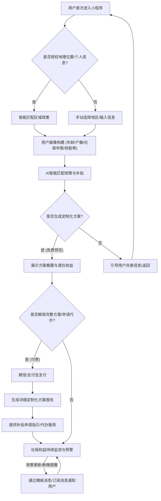

# 业务需求说明书 (BRD) - AI替代人群社保定制化筹划

| 文档属性 | 内容 |
| :--- | :--- |
| **产品名称** | AI社保智筹 |
| **版本号** | V1.2.0 |
| **文档级别** | L4 (Standard) |
| **状态** | 生效 |
| **发布日期** | 2026-07-03 |
| **更新说明** | V1.2.0: 新增社保沙盘模拟器、AI社保顾问、移动端五端全覆盖；更新KPI和竞争壁垒；V1.1.0归档。 |

## 1. 产品概述与愿景

**产品名称：** AI社保智筹

**产品愿景：** 成为AI时代灵活就业人员社保筹划的首选智能平台，赋能个体，确保其社会保障权益，实现无忧灵活就业。

**产品描述：** AI社保智筹是一款基于人工智能和大数据技术的社保定制化筹划服务平台。它旨在解决因AI技术发展而转为灵活就业的专业人士在社保缴纳方面面临的政策信息不对称、缴纳成本高、权益延续焦虑等核心痛点。通过深度整合国家、省、市、区、街道等多层级社保政策，结合用户个人全方位信息，智能匹配并生成“一人一方案”的社保缴纳最优解，并提供便捷的政策咨询、补贴申请指导及权益监测服务。

## 2. 业务目标与量化指标 (KPI)

本产品将通过以下量化指标来衡量其业务成功和用户价值：

| 目标类别 | 业务目标 | 关键绩效指标 (KPI) | 目标值 (上线首年) |
| :--- | :--- | :--- | :--- |
| **用户增长** | 扩大用户基础，触达目标群体 | 注册用户数 | 100,000+ |
| | | 新增付费用户数 | 10,000+ |
| **用户活跃** | 提升用户参与度与粘性 | 月活跃用户 (MAU) | 50,000+ |
| | | 方案生成率 (注册用户中生成完整方案的比例) | > 60% |
| **用户转化** | 促进用户从免费服务向付费服务转化 | 付费转化率 (方案解锁/代办服务) | 3% - 5% |
| | | ARPU (每用户平均收入) | 50-200元 |
| **用户留存** | 保持用户长期使用和信任 | 次月留存率 (用于权益监测的用户) | > 30% |
| **服务效率** | 提升政策匹配与方案生成的准确性 | 政策匹配准确率 | > 98% |
| | | 补贴申请成功率 | > 90% |
| **用户价值** | 为用户创造实际经济效益 | 平均为用户节省/补贴获益 | > 2000元/年 |
| **市场份额** | 确立行业领先地位 | 灵活就业社保筹划市场份额 | 5% |

## 3. 需求追踪矩阵 (Requirements Traceability Matrix)

下表展示了从市场/用户痛点到业务目标，再到具体功能需求的映射关系，确保产品开发紧密围绕用户价值和业务目标。

| 市场/用户痛点 | 业务目标 | 核心功能模块 | 具体功能需求 | 优先级 |
| :--- | :--- | :--- | :--- | :--- |
| 政策信息碎片化、滞后性 | 提高政策利用率 | 动态实时政策库与AI智能解析 | 1.1 政策数据自动化采集 (国家/省/市/区/街道) | P0 |
| | | | 1.2 政策文本AI结构化与标签化 | P0 |
| | | | 1.3 政策更新实时推送 (订阅消息) | P1 |
| 不了解各地补贴政策 | 提升用户补贴获益 | 智能政策匹配引擎 | 2.1 基于LBS的区域政策自动匹配 | P0 |
| | | | 2.2 基于个人画像的补贴条件智能筛选 | P0 |
| | | | 2.3 “4050”等特殊群体政策识别 | P0 |
| 缴纳成本高，方案不优 | 降低用户经济压力 | 定制化方案生成器 | 3.1 帕累托最优缴纳基数推荐 | P0 |
| | | | 3.2 多维度社保缴纳方案对比 (不同基数/险种组合) | P0 |
| | | | 3.3 补贴获益最大化测算 | P0 |
| 办理流程复杂，材料繁琐 | 简化办事体验，提高效率 | 合规性认定与流程引导 | 4.1 补贴申请条件与材料清单可视化 | P0 |
| | | | 4.2 线上申请入口指引/线下办理流程图 | P1 |
| | | | 4.3 “就业困难人员”等身份认定辅助 | P1 |
| 担心断缴影响权益 | 确保权益连续性与稳定性 | 权益监测与风险预警 | 5.1 社保缴纳状态实时查询 | P1 |
| | | | 5.2 断缴风险预警与提醒 | P1 |
| | | | 5.3 权益转移接续指导 | P2 |
| 缺乏专业咨询 | 提供专业支持 | 智能客服与专家咨询 | 6.1 AI智能问答机器人 | P1 |
| | | | 6.2 在线人工社保顾问咨询 (付费) | P1 |

## 4. 业务流转图 (Business Process Flow)

本产品的核心业务流转将围绕用户从初次接触到持续服务的全生命周期展开，主要通过微信/支付宝小程序承载。

**流程说明：**
1.  **用户触达与授权：** 用户通过微信/支付宝搜索或分享进入小程序。首次进入时，引导用户授权地理位置和基础个人信息（如手机号、头像），以实现快速注册和初步政策匹配。
2.  **信息采集与画像构建：** 用户可进一步完善个人信息，包括户籍地、居住地、年龄、社保缴纳年限、技能证书、家庭成员情况等，系统据此构建详细用户画像。
3.  **智能匹配与方案生成：** AI引擎结合用户画像和动态政策库，智能匹配国家、省、市、区、街道等多层级的灵活就业社保政策及补贴优惠，并生成定制化方案的概要预览。
4.  **付费解锁与服务：** 用户可选择付费解锁完整定制化方案报告，或直接选择代办补贴申请服务。支付通过微信/支付宝支付完成。
5.  **持续服务与监测：** 平台将持续监测用户社保缴纳状态和政策更新，通过微信模板消息或订阅消息及时提醒用户，确保权益不受损。
6.  **智能客服与专家咨询：** 在整个流程中，用户可随时通过智能客服获取帮助，或付费转接专业社保顾问进行一对一咨询。

## 5. 核心功能模块

### 5.1 智能政策匹配引擎
*   **功能描述：** 接收用户输入的个人信息，通过AI算法实时匹配国家、省、市、区、街道等多层级的灵活就业社保政策及补贴优惠。特别关注“4050”政策、就业困难人员认定、高技能人才补贴、育儿补贴等细分政策 [1] [14]。
*   **技术实现：** 结合自然语言处理（NLP）技术解析政策文本，构建多维度政策标签体系；利用规则引擎和机器学习模型进行用户画像与政策的精准匹配。

### 5.2 定制化方案生成器
*   **功能描述：** 基于智能政策匹配结果，为用户生成“一人一方案”的社保缴纳定制化方案。方案内容包括最优缴纳基数建议、补贴申请指导、权益延续策略及风险提示。
*   **技术实现：** 运用优化算法（如帕累托优化）在多种约束条件下（政策合规、用户经济承受能力、权益最大化）寻找最优解。方案以结构化数据和易读的报告形式呈现。

### 5.3 动态政策库与实时更新
*   **功能描述：** 建立一个覆盖全国各级行政区域的灵活就业社保政策动态数据库。通过自动化爬虫技术定期抓取政府官网、新闻媒体等公开信息，结合人工审核与专家校验，确保政策信息的实时性、准确性和完整性。
*   **技术实现：** 大数据存储与管理；爬虫技术与NLP技术结合进行政策文本提取与结构化；人工审核平台与专家团队协作。

### 5.4 合规性认定与流程引导
*   **功能描述：** 提供“就业困难人员”、“高技能人才”等特殊身份认定的详细指导，包括申请条件、所需证明材料、办理机构、线上/线下流程等。帮助用户合法合规地获取更多政策优惠。
*   **技术实现：** 流程图可视化；材料清单自动化生成；在线表单填写辅助；与政府服务平台接口对接（若条件允许）。

### 5.5 智能客服与专家咨询
*   **功能描述：** 提供基于AI的智能客服，解答用户常见问题。对于复杂或个性化问题，可转接至专业社保顾问进行一对一咨询服务。
*   **技术实现：** 知识图谱与问答系统；在线聊天工具；专家排班与工单管理系统。

## 6. 业务模式与盈利模式

### 6.1 业务模式
*   **B2C模式：** 直接面向灵活就业人员提供社保筹划服务。
*   **B2B模式（未来拓展）：** 与人力资源服务机构、自由职业者平台、行业协会等合作，提供批量社保筹划解决方案。

### 6.2 盈利模式
*   **会员订阅费：** 提供不同等级的会员服务，享受不同深度的政策匹配、方案生成和咨询服务。
*   **定制化方案服务费：** 对生成深度定制化方案收取一次性或按年服务费。
*   **增值服务费：** 提供社保代办、就业困难认定协助、法律咨询等增值服务。
*   **广告与合作（未来探索）：** 在合规前提下，与金融机构、商业保险公司等进行合作，提供相关产品推荐。

## 7. 技术架构建议

本产品将采用“小程序优先（Mini-program First）”的策略，以微信小程序和支付宝小程序作为核心用户触达和交互平台，辅以Web管理后台。

*   **前端：**
    *   **微信小程序/支付宝小程序：** 采用原生开发或Uni-app等跨端框架进行开发，确保在两大主流生态中的流畅体验和功能完整性。深度集成小程序生态能力。
    *   **Web管理后台：** 采用主流前端框架（如React/Vue），用于运营管理、政策录入、数据分析等。
*   **小程序生态集成：**
    *   **微信/支付宝支付：** 用于方案解锁、会员订阅、代办服务等付费场景。
    *   **微信模板消息/订阅消息：** 用于政策更新提醒、补贴到账通知、断缴风险预警、服务进度通知等，提升用户留存和活跃度。
    *   **地理位置 (LBS) 授权：** 自动获取用户所在地理位置，精准匹配街道级政策，提升用户体验。
    *   **微信/支付宝授权 (手机号/头像)：** 简化注册登录流程，降低用户门槛。
*   **后端：** 采用微服务架构，基于Spring Boot/Node.js等技术栈，实现高并发、高可用。核心服务包括用户管理、政策管理、匹配引擎、方案生成、支付结算、消息推送等。
*   **数据库：** 关系型数据库（如MySQL/PostgreSQL）存储用户数据、政策数据；非关系型数据库（如Elasticsearch）用于政策文本检索和知识图谱构建。
*   **AI/大数据平台：** 部署机器学习模型，用于政策解析、用户画像、方案优化。利用大数据技术进行政策趋势分析和用户行为洞察。
*   **云服务：** 部署在主流云平台（如阿里云、腾讯云），利用其弹性伸缩、安全防护、DevOps等能力，并优先考虑与小程序生态紧密结合的云服务（如腾讯云的微信小程序云开发）。

## 8. 核心壁垒与不可复制性策略

本产品的核心壁垒和不可复制性主要体现在以下几个方面：

*   **深度定制化的“一人一方案”能力：** 区别于市面上通用型社保服务，本产品能够深入到个人所能提供的全方位信息，结合国家、省、市、区、**街道**等多层级政策，生成高度个性化、帕累托最优的社保缴纳方案。这种精细化程度是现有竞品难以企及的 [8] [11] [12]。
*   **动态实时政策库与AI智能解析：** 建立并维护一个覆盖全国、实时更新、颗粒度细致到街道层级的社保政策数据库，并结合AI智能解析技术，能够迅速捕捉政策变动并应用于方案生成。这需要持续投入大量人力和技术资源，形成高进入壁垒 [1] [7]。
*   **合规性认定与专业指导：** 针对“就业困难人员”、“4050人员”等特殊身份的认定，提供专业、合规的指导流程，帮助用户合法享受政策红利。这需要对各地政策有深刻理解和实践经验，并建立信任机制 [14]。
*   **数据积累与模型优化：** 随着用户数据的积累和反馈，AI匹配引擎和方案生成器将不断学习和优化，提供更精准、更智能的服务。这种数据驱动的迭代能力将形成强大的竞争优势，且难以被新进入者快速复制。
*   **专业团队与专家网络：** 组建一支由社保专家、法律顾问、AI工程师、产品经理组成的跨领域团队，并建立广泛的政策研究与咨询专家网络，确保服务的专业性和权威性。
*   **小程序生态深度集成：** 充分利用微信/支付宝小程序的流量入口、支付、消息触达、LBS等能力，构建用户友好的服务闭环，形成独特的渠道优势和用户粘性。
*   **社保沙盘模拟器：** 业界首创的交互式社保决策模拟工具。用户通过拖动滑块（缴费基数/年限/城市）即可实时看到养老金预测、补贴匹配、购房/落户资格变化。所有阈值（如最低缴费年限15→20年的渐进式政策）动态从政策库读取，不硬编码。结合NSGA-II三目标帕累托优化（成本↓+养老金↑+公平性↑），为用户提供科学的决策依据。
*   **AI社保顾问：** 基于RAG（检索增强生成）技术的7×24小时个性化社保咨询。每次回答不超过3句话，必须引用具体政策来源。自动注入用户沙盘参数和画像数据，确保回答个性化。当LLM不可用时优雅降级为"建议咨询12333"。

## 参考文献
[1] ILO. (Unknown). 中国灵活就业人员和平台从业人员的社会保障研究. [https://www.ilo.org/sites/default/files/wcmsp5/groups/public/@asia/@ro-bangkok/@ilo-beijing/documents/publication/wcms_861984.pdf](https://www.ilo.org/sites/default/files/wcmsp5/groups/public/@asia/@ro-bangkok/@ilo-beijing/documents/publication/wcms_861984.pdf)
[7] ILO. (Unknown). 中国灵活就业人员和平台从业人员的社会保障研究. [https://www.ilo.org/sites/default/files/wcmsp5/groups/public/@asia/@ro-bangkok/@ilo-beijing/documents/publication/wcms_861984.pdf](https://www.ilo.org/sites/default/files/wcmsp5/groups/public/@asia/@ro-bangkok/@ilo-beijing/documents/publication/wcms_861984.pdf)
[8] 中原区人民政府. (Unknown). 建设路街道：多措并举推进灵活就业人员社保补贴工作. [https://www.zhongyuan.gov.cn/jddt/8632337.jhtml](https://www.zhongyuan.gov.cn/jddt/8632337.jhtml)
[11] 东莞市人力资源和社会保障局. (2024年12月11日). 《灵活就业社保补贴》政策解读. [http://dghrss.dg.gov.cn/ztzl/jycyxxgk/zczy/zcjd/content/post_4311015.html](http://dghrss.dg.gov.cn/ztzl/jycyxxgk/zczy/zcjd/content/post_4311015.html)
[12] 房山区人民政府. (Unknown). 城镇就业困难人员灵活就业申请社会保险补贴办事指南. [https://www.bjfsh.gov.cn/ztzx/wqzt/zdlyzfgkzt/xzqd/jycy/ysbsc/201812/t20181216_39944019.shtml](https://www.bjfsh.gov.cn/ztzx/wqzt/zdlyzfgkzt/xzqd/jycy/ysbsc/201812/t20181216_39944019.shtml)
[14] 中国太平洋保险. (2024年11月7日). 什么是4050政策，中年人的社保福利申请“4050”补贴有哪些注意事项？ [https://m.cpic.com.cn/c/2024-11-07/1867443.shtml](https://m.cpic.com.cn/c/2024-11-07/1867443.shtml)
